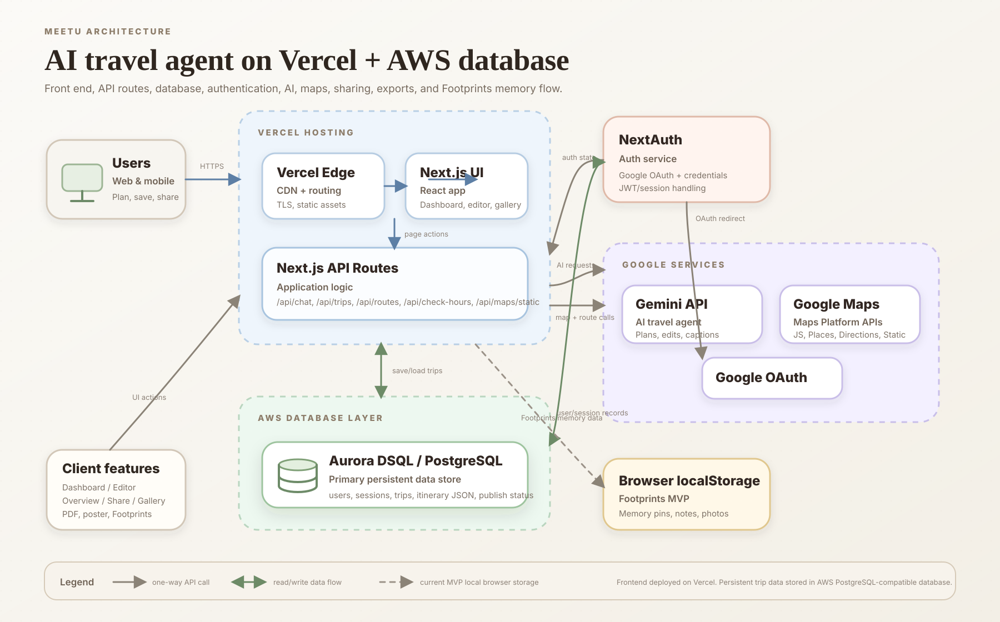
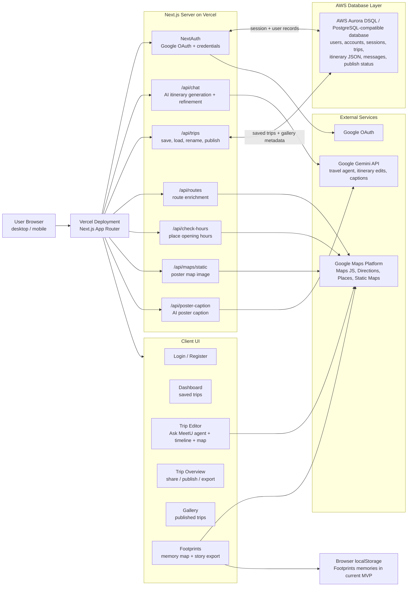

# MeetU Architecture Diagram

Editable diagrams.net / draw.io source: [meetu-architecture.drawio](meetu-architecture.drawio)

The polished SVG version above is intended for hackathon submission screenshots or direct upload. The Mermaid version below is kept as an editable technical backup.

## Data Flow

1. Users open MeetU from the Vercel-hosted Next.js application.
2. Authentication is handled by NextAuth using Google OAuth or email/password credentials.
3. Users create or refine trips in the Trip Editor. The editor calls `/api/chat`, which uses the Google Gemini API to generate structured itinerary JSON.
4. The itinerary is enriched with Google Maps data through server routes for directions, transit options, static maps, and opening-hour context.
5. Saved trips, user sessions, share status, and gallery publish metadata are stored in the AWS database.
6. The Dashboard reads saved trips from the database. The Overview page displays a polished, shareable version of a saved trip.
7. Published trips appear in the Gallery and link to public overview pages.
8. Poster and PDF export are generated from the saved itinerary content.
9. The Footprints feature lets users place memories on a real map with photos, notes, and emoji pins. In the current MVP, these memories are stored in browser localStorage.

## AWS Database Used

The application uses an AWS PostgreSQL-compatible database layer for persistent product data. In the current codebase, the database client connects through an Aurora DSQL endpoint using AWS DSQL authentication.
