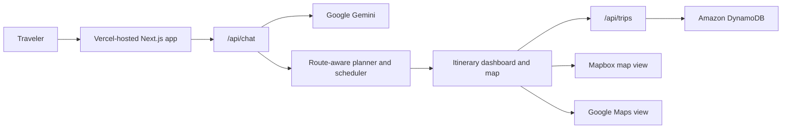

# AtlasLoop

AtlasLoop is a full-stack AI travel planning app for consumers. A traveler enters a dark cinematic planning console, talks with an AI travel copilot, locks a home base on the map, and receives a route-aware itinerary with scheduled stops, feasibility scoring, map markers, and saved trip snapshots.

## Hackathon Track

Track 1: Monetizable B2C app.

AtlasLoop targets travelers who want a personal planning assistant without paying a human itinerary consultant. The product can monetize through premium trip exports, collaborative planning, affiliate bookings, and saved itinerary libraries.

## AWS Database

This project uses Amazon DynamoDB.

DynamoDB stores trip snapshots by browser session:

- Partition key: `pk`, for example `SESSION#abc123`
- Sort key: `sk`, for example `TRIP#2026-05-30T10:20:30.000Z#trip-id`
- Stored fields: trip id, destination, summary, feasibility score, created timestamp, and full itinerary JSON

The app also runs without AWS credentials for local demos. In that mode, the UI shows that DynamoDB is not configured and the generated itinerary remains usable.

## Stack

- Next.js App Router and TypeScript
- Tailwind CSS
- Google Gemini for AI-led trip interview and itinerary generation
- Amazon DynamoDB for saved trip snapshots
- Mapbox and Google Maps for map display
- Vercel for front-end and serverless deployment

## Environment Variables

Create `.env.local`:

```bash
GEMINI_API_KEY=your_google_ai_studio_key
NEXT_PUBLIC_MAPBOX_TOKEN=your_mapbox_token
NEXT_PUBLIC_GOOGLE_MAPS_KEY=your_google_maps_key

AWS_REGION=us-east-1
AWS_ACCESS_KEY_ID=your_aws_access_key_id
AWS_SECRET_ACCESS_KEY=your_aws_secret_access_key
AWS_SESSION_TOKEN=optional_session_token
DYNAMODB_TABLE_NAME=AtlasLoopTrips
```

## Local Development

```bash
npm install
npm run dev
```

Open `http://localhost:3000`.

## DynamoDB Table

Create a DynamoDB table with:

- Table name: `AtlasLoopTrips`
- Partition key: `pk` as string
- Sort key: `sk` as string

No secondary index is required for the demo.

## Architecture



## Demo Story

1. Start in the animated cyberpunk planning console.
2. The AI asks one question at a time instead of showing a traditional form.
3. When the traveler gives a home base, the interface animates into a map lock sequence.
4. The planner schedules each day, estimates travel time, and scores feasibility.
5. The dashboard shows the active day route, pressure points, travel minutes, cost estimate, and map.
6. The server saves the itinerary snapshot to DynamoDB when AWS credentials are configured.
