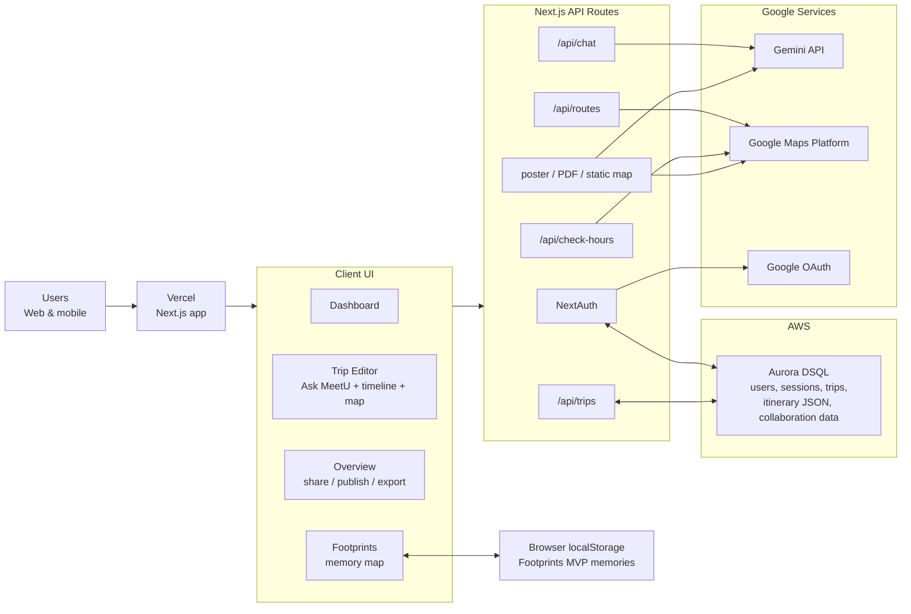

# MeetU

MeetU is an AI-powered travel planning agent that turns a rough trip idea into a structured, editable, saveable, and shareable itinerary.

Instead of asking travelers to juggle search tabs, maps, spreadsheets, notes, opening hours, and route estimates, MeetU gives them one workspace where they can generate a realistic trip timeline, refine it through natural language, save it to a dashboard, share it with others, and export it as a polished travel plan.

## Tagline

**Plan the trip. Save the story. Share the journey.**

## What MeetU Solves

Travel planning is exciting, but the actual workflow is fragmented. A traveler often has to:

- research attractions, restaurants, and neighborhoods across many tabs
- estimate how long each stop should take
- check transportation between places
- rewrite the plan whenever a booking or time constraint changes
- turn the final plan into something presentable enough to share

MeetU solves this by combining an AI itinerary agent, map context, route enrichment, persistent trip storage, collaboration-ready data, and exportable travel documents.

## Core Features

- **AI trip generation**: create day-by-day itineraries from destination, dates, travelers, trip style, accommodation area, and available daily time.
- **Concrete timeline planning**: activities include start time, end time, duration, and travel blocks between stops.
- **Ask MeetU agent**: refine the itinerary through natural language, such as adding fixed bookings or changing a day's schedule.
- **Route context**: enrich travel segments with Google Maps route options, including public transit, walking, ferry, light rail, taxi, and rideshare where available.
- **Opening-hour context**: show place availability and warnings when data is available.
- **Saved trips dashboard**: persist generated itineraries and reopen them later.
- **Overview mode**: view a polished, shareable version of a completed trip.
- **Trip sharing**: generate public read-only links for saved itineraries.
- **Public gallery**: publish selected itineraries so other users can browse them.
- **Collaboration foundation**: invite collaborators, manage roles, show presence, comments, and editing locks for shared trips.
- **Poster export**: generate a scrapbook-style itinerary poster.
- **PDF export**: export a clean text-first travel plan.
- **Footprints**: pin travel memories on a real map with photos, notes, emoji markers, and a scrapbook-style memory timeline.
- **3D Footprints story**: experimental scroll-driven 3D memory presentation built with React Three Fiber.

## Tech Stack

| Layer | Technology |
| --- | --- |
| Frontend | Next.js App Router, React, TypeScript |
| Styling | Tailwind CSS v4, custom responsive CSS |
| Deployment | Vercel |
| Database | **AWS Aurora DSQL** |
| Database access | `pg`, AWS DSQL SigV4 auth through `@aws-sdk/dsql-signer` |
| Authentication | NextAuth, Google OAuth, email/password credentials |
| AI | Google Gemini API (`gemini-2.5-flash-lite`) |
| Maps | Google Maps Platform, Mapbox fallback |
| Interactions | Framer Motion, dnd-kit |
| 3D Storytelling | Three.js, React Three Fiber, Drei, Maath |
| Exports | Canvas-based poster export, custom PDF generation |

## Architecture

The application is deployed as a full-stack Next.js app on Vercel. Client views and server API routes live in the same Next.js project.


```mermaid
flowchart LR
  U["Users<br/>Web & mobile"] --> V["Vercel<br/>Next.js app"]

  subgraph Client["Client UI"]
    D["Dashboard"]
    E["Trip Editor<br/>Ask MeetU + timeline + map"]
    O["Overview<br/>share / publish / export"]
    F["Footprints<br/>memory map"]
  end

  subgraph Server["Next.js API Routes"]
    AUTH["NextAuth"]
    CHAT["/api/chat"]
    TRIPS["/api/trips"]
    ROUTES["/api/routes"]
    HOURS["/api/check-hours"]
    EXPORTS["poster / PDF / static map"]
  end

  subgraph AWS["AWS"]
    DSQL["Aurora DSQL<br/>users, sessions, trips,<br/>itinerary JSON, collaboration data"]
  end

  subgraph Google["Google Services"]
    GEMINI["Gemini API"]
    MAPS["Google Maps Platform"]
    OAUTH["Google OAuth"]
  end

  V --> Client
  Client --> Server
  AUTH <--> DSQL
  TRIPS <--> DSQL
  CHAT --> GEMINI
  EXPORTS --> GEMINI
  ROUTES --> MAPS
  HOURS --> MAPS
  EXPORTS --> MAPS
  AUTH --> OAUTH
  F <--> LOCAL["Browser localStorage<br/>Footprints MVP memories"]
```

An editable draw.io architecture file is included at [`meetu-architecture.drawio`](./meetu-architecture.drawio), and a polished SVG export is available at [`public/meetu-architecture-diagram.svg`](./public/meetu-architecture-diagram.svg).

## AWS Aurora DSQL Usage

MeetU uses **AWS Aurora DSQL** as the main persistent database.

Aurora DSQL stores:

- users, accounts, and session-related authentication records
- saved trips and dashboard metadata
- full itinerary JSON generated by the AI agent
- chat message history for saved trips
- publish status for the public gallery
- collaboration roles and invited users
- comments, presence, and editing locks for shared trips

The app connects to Aurora DSQL with short-lived AWS SigV4 database authentication tokens using `@aws-sdk/dsql-signer`. The database client is defined in [`src/lib/db.ts`](./src/lib/db.ts).

Because Aurora DSQL has a different feature surface from a traditional single-node PostgreSQL database, the application avoids relying on cascading foreign keys, `ON CONFLICT`, and connection pooling patterns that do not fit DSQL. Instead, the code uses explicit cleanup, defensive upserts, optimistic version checks, and fresh authenticated clients.

## Data Model Overview

The main persisted entities are:

- `users`: app users created by Google OAuth or email/password registration
- `accounts`: OAuth account records used by NextAuth
- `sessions`: session records used by auth flows
- `trips`: saved itinerary records, including title, destination, dates, travelers, style, summary, itinerary JSON, chat messages, version, and publish state
- `trip_collaborators`: invited users and their roles
- `trip_comments`: trip-level and day-level discussion
- `trip_locks`: temporary day or AI editing locks
- `trip_presence`: lightweight collaborator presence

Footprints memories are currently stored in browser `localStorage` for the MVP. They can later be moved into Aurora DSQL or object storage-backed persistence.

## Getting Started

### 1. Install dependencies

```bash
npm install
```

### 2. Create environment variables

Copy `.env.example` to `.env.local` and fill in the required values.

```bash
cp .env.example .env.local
```

### 3. Run the development server

```bash
npm run dev
```

Open [http://localhost:3000](http://localhost:3000).

## Environment Variables

| Variable | Purpose |
| --- | --- |
| `AUTH_SECRET` | NextAuth secret used to sign auth state |
| `AUTH_TRUST_HOST` | Required when deployed behind Vercel/proxy hosting |
| `AUTH_URL` | Local or deployed app URL |
| `GOOGLE_CLIENT_ID` | Google OAuth client ID |
| `GOOGLE_CLIENT_SECRET` | Google OAuth client secret |
| `GEMINI_API_KEY` | Google AI Studio key for Gemini |
| `DSQL_CLUSTER_ENDPOINT` | Aurora DSQL cluster endpoint |
| `AWS_REGION` | AWS region for Aurora DSQL signing |
| `AWS_ACCESS_KEY_ID` | AWS access key with DSQL connection permissions |
| `AWS_SECRET_ACCESS_KEY` | AWS secret key with DSQL connection permissions |
| `AWS_SESSION_TOKEN` | Optional session token for temporary AWS credentials |
| `NEXT_PUBLIC_GOOGLE_MAPS_KEY` | Browser-side Google Maps key |
| `GOOGLE_MAPS_KEY` | Server-side Google Maps key |
| `GOOGLE_DIRECTIONS_API_KEY` | Optional dedicated key for Directions API |
| `GOOGLE_PLACES_API_KEY` | Optional dedicated key for Places/opening-hours checks |
| `NEXT_PUBLIC_MAPBOX_TOKEN` | Optional Mapbox token used as a map fallback |

## Database Setup

Aurora DSQL setup requires the auth tables, trips table, gallery columns, and collaboration tables.

Create the NextAuth tables:

```bash
node --env-file=.env.local --import tsx/esm scripts/migrate-auth.ts
```

The app expects a `trips` table with the core saved-trip fields used by [`src/app/api/trips/route.ts`](./src/app/api/trips/route.ts). If your DSQL database does not already have it, create it with:

```sql
CREATE TABLE IF NOT EXISTS trips (
  id           TEXT NOT NULL PRIMARY KEY,
  owner_id     TEXT NOT NULL,
  title        TEXT NOT NULL,
  destination  TEXT NOT NULL,
  start_date   TEXT NOT NULL,
  end_date     TEXT NOT NULL,
  travelers    INTEGER NOT NULL,
  style        TEXT NOT NULL,
  summary      TEXT NOT NULL,
  itinerary    JSON NOT NULL,
  messages     JSON,
  is_published BOOLEAN,
  published_at TIMESTAMPTZ,
  version      BIGINT,
  updated_by   TEXT,
  created_at   TIMESTAMPTZ NOT NULL,
  updated_at   TIMESTAMPTZ NOT NULL
);
```

Run the additional idempotent migrations:

```bash
npm run db:migrate-gallery
npm run db:migrate-collaboration
```

## Available Scripts

| Script | Description |
| --- | --- |
| `npm run dev` | Start the local Next.js development server |
| `npm run build` | Build the production app |
| `npm run start` | Start the built production app |
| `npm run lint` | Run ESLint |
| `npm run db:migrate-gallery` | Add gallery publishing fields to trips |
| `npm run db:migrate-collaboration` | Add collaboration, comment, lock, and presence tables |
| `npm run db:fix-auth-ids` | Repair auth ID defaults for existing data if needed |

## Project Structure

```text
src/
  app/                    Next.js routes and API handlers
  app/api/chat/           Gemini-powered itinerary generation and refinement
  app/api/trips/          Save, load, rename, publish, share, collaborate
  app/api/routes/         Google Maps route enrichment
  app/api/check-hours/    Place opening-hour checks
  components/             UI components for auth, dashboard, editor, overview, gallery, footprints
  components/canvas/      Trip editor, itinerary timeline, overview, maps, exports
  components/footprints/  Memory map and 3D story experience
  components/collaboration/
                           Share modal, comments, presence, collaboration UI
  hooks/useChat.ts        Main itinerary state, save/load, AI edits, collaboration sync
  lib/db.ts               Aurora DSQL client
  lib/posterExport.ts     Poster generation
  lib/itineraryPdf.ts     PDF generation
  types/travel.ts         Shared itinerary and collaboration types
scripts/
  migrate-auth.ts
  migrate-gallery.mjs
  migrate-collaboration.mjs
public/
  meetu-architecture-diagram.svg
```

## Deployment

The frontend and backend API routes are designed to deploy together on Vercel.

For Vercel deployment:

1. Add all required environment variables in the Vercel project settings.
2. Ensure Google OAuth redirect URLs include the deployed domain.
3. Enable the required Google Maps Platform APIs for the configured API keys.
4. Configure AWS credentials and `DSQL_CLUSTER_ENDPOINT` for Aurora DSQL access.
5. Run the database setup scripts against the DSQL cluster before using saved trips.

## Hackathon Submission Notes

- **Track fit**: MeetU fits a monetizable B2C travel-planning product, with future potential for collaborative travel planning and premium export/gallery templates.
- **AWS database used**: AWS Aurora DSQL.
- **Vercel usage**: Next.js frontend and API routes are deployed through Vercel.
- **Working application footage to show**: trip generation, agent refinement, save dashboard, overview/share, poster/PDF export, gallery, and Footprints.
- **Architecture diagram**: see [`meetu-architecture.drawio`](./meetu-architecture.drawio) and [`public/meetu-architecture-diagram.svg`](./public/meetu-architecture-diagram.svg).

## Future Work

- Persist Footprints memories in Aurora DSQL and move uploaded photos to object storage.
- Add richer collaborative editing workflows and trip invitations.
- Add budget planning and booking integrations.
- Add more overview skins and export templates.
- Improve route optimization for long multi-day trips.
- Export Footprints stories as video or animated share pages.
