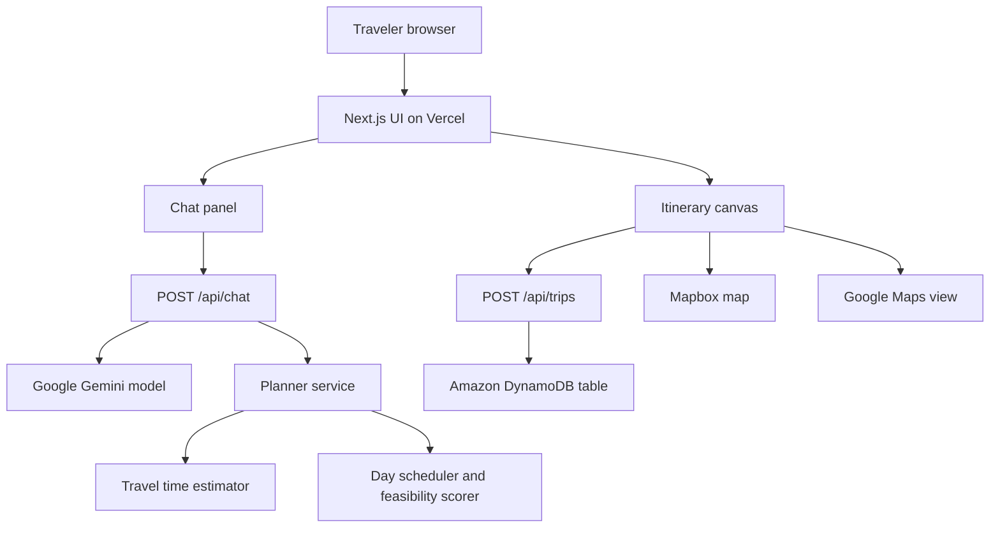

# AtlasLoop Architecture

## Component Diagram

## Data Flow

1. The traveler submits a trip brief in the Vercel-hosted Next.js app.
2. `/api/chat` sends the conversation context to Gemini and receives structured itinerary JSON.
3. The local planner service converts activities into scheduled route stops with travel estimates and feasibility scores.
4. The dashboard renders the itinerary, active day route, map markers, cost estimate, and pressure points.
5. `/api/trips` signs a DynamoDB request with AWS Signature Version 4 and stores the itinerary snapshot.

## AWS Database

Database used: Amazon DynamoDB.

The table stores trip snapshots for fast session-based reads. The demo table only needs a partition key and sort key:

- `pk`: string
- `sk`: string

Recommended table name: `AtlasLoopTrips`.
